# PPS-Unidad2Actividad1-Raul_Albalat_Perez 

# Trazado de vulnerabilidad segun [este artículo](https://www.incibe.es/empresas/avisos/vulnerabilidad-critica-de-omision-de-autenticacion-en-goanywhere-mft-de-fortra).

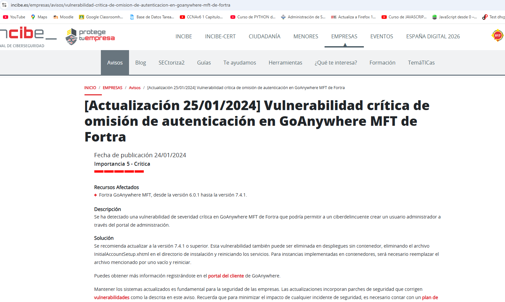

Como podemos observar. En este en lace nos habla de la **Vulnerabilidad crítica de omisión de autenticación en GoAnywhere MFT de Fortra** publicada en **24/01/2024** y que tiene una importancia **crítica**. 

Fortra ha informado a incibe de la vulnerabilidad **CVE-2024-0204** la cual vamos a realizar su trazado.

# Trazado de Vulnerabilidad - CVE-2024-0204

## Descripción General
**CVE-2024-0204** es una vulnerabilidad crítica que afecta a **GoAnywhere MFT** de **Fortra**, que permite la **ejecución remota de código**. Un atacante no autenticado puede explotar esta vulnerabilidad para ejecutar comandos arbitrarios en el servidor afectado, comprometiendo el sistema y los datos almacenados.

Para ver mas detalladamente la información de la vulnerabilidad [Incibe-CVE-2024-0204](https://www.incibe.es/empresas/avisos/vulnerabilidad-critica-de-omision-de-autenticacion-en-goanywhere-mft-de-fortra). Pinchamos ne el listado de referencias que nos muestra al final de la pagina.

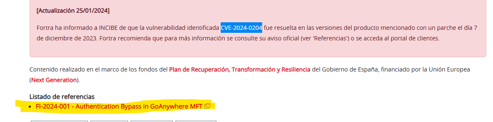

En [dicha página](https://www.fortra.com/security/advisories/product-security/fi-2024-001) el desarrollador  nos informa del problema, de los productos afectados, Cuando se descubríó así como el CWE que se le asignó.

Con toda lo información recogida de ambos enlaces. Procedemos a realizar el trazado de la vulnerabilidad **CVE-2024-0204**

---

## Fuentes de Información

Para ver la información sobre dicha vulnerabilidad a las siguientes fuentes.

1. **CVE-2024-0204 en CVE.org**:  
   [CVE-2024-0204 - cve.org](https://www.cve.org/CVERecord?id=CVE-2024-0204)

2. **Base de datos de vulnerabilidades (NVD)**:  
   [CVE-2024-0204 en NIST:NVD](https://nvd.nist.gov/vuln/detail/CVE-2024-0204)

3. **INCIBE**:  
   [Artículo de INCIBE](https://www.incibe.es/empresas/avisos/vulnerabilidad-critica-de-omision-de-autenticacion-en-goanywhere-mft-de-fortra)

4. **Fortra**
   [CVE-2024-0204 EN FORTRA](https://www.fortra.com/security/advisories/product-security/fi-2024-001)
---

## Informacion sobre riesgo y criticidad de la vulnerabilidad CVE-2024-0204 (NISt:NVD)

Desde la [entrada correspondiente a NIST:NVD](https://nvd.nist.gov/vuln/detail/CVE-2024-0204) podemos encontrar información de la criticabilidad de la vulnerabilidad (9.8) marcada como crítica.

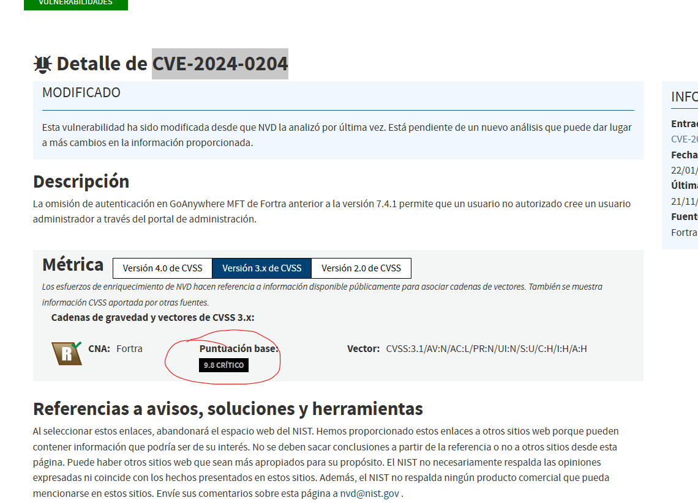

La vulnerabilidad **CVE-2024-0204** en **GoAnywhere MFT** permite a los atacantes remotos ejecutar **código arbitrario** sin necesidad de autenticación previa. Esto puede ser explotado para obtener **acceso no autorizado** a los datos y sistemas, lo que representa un **riesgo grave** para la confidencialidad, integridad y disponibilidad de la infraestructura afectada.

Poniendonos encima del cursor podemos ver los valores de las métricas usadas para el cálculo.

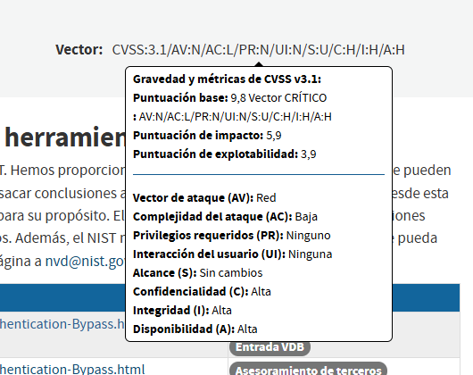

- **Tipo de vulnerabilidad**: Ejecución remota de código (RCE)
- **Impacto**: Alto (confidencialidad, integridad, disponibilidad)
- **Nivel de severidad**: Crítico (CVSS 9.8)

---

## Información sobre el Riesgo y Criticidad

### **CVSS (Common Vulnerability Scoring System)**

- **Puntuación CVSS**: 9.8 (Crítico)
- **Vector de ataque**: Red
- **Privilegios requeridos**: Ninguno
- **Interacción con el usuario**: Ninguna

### **Métricas de Explotabilidad**:

- **Explotabilidad**: Baja (sin privilegios requeridos, sin interacción del usuario)
- **Alcance**: No modificado

### **Métricas de Impacto**:

- **Impacto en Confidencialidad**: Alto
- **Impacto en Integridad**: Alto
- **Impacto en Disponibilidad**: Alto

---
Tambien podemos ver la **Enumeración de debilidades**  en la que podemos ver la [CWE-425](https://cwe.mitre.org/data/definitions/425.html) y observamos más informacion 

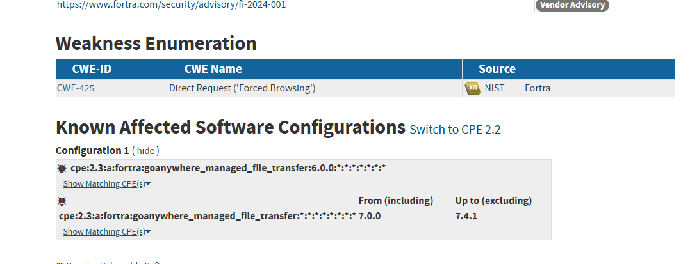

## Debilidades Explotadas (CWE) en Mitre.

### **CWE-425: Uncontrolled Resource Consumption (Consumo no controlado de recursos)**

Esta debilidad describe la falta de control sobre los recursos del sistema, que puede llevar a **consumo excesivo de recursos** o incluso a la ejecución de **código malicioso** en el sistema afectado. La vulnerabilidad **CVE-2024-0204** explota esta debilidad para ejecutar **comandos arbitrarios**.

Nos dice que  La aplicación web no aplica adecuadamente la autorización adecuada en todas las URL, secuencias de comandos o archivos restringidos.
posibles mitigaciones.

**Fases: Arquitectura y Diseño; Operación**
- Aplique las autorizaciones de control de acceso adecuadas para cada acceso a todas las URL, scripts o archivos restringidos.

**Fase: Arquitectura y Diseño**
- Considere la posibilidad de utilizar marcos basados ​​en MVC, como Struts.

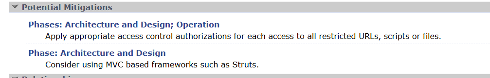

Tambien podemos ver las relaciones entre ésta y otras debilidades.

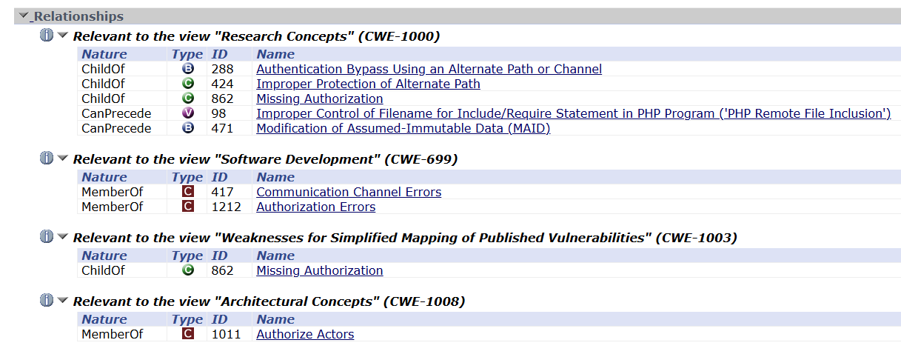

Podemos observar que esta debilidadad es hija de la **CWE-288 , LA CWE-424 Y LA CWE-862**

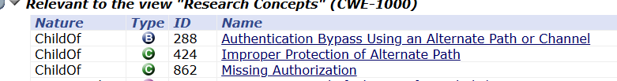

Si continuamos viendo mas imformación dentro del [CWE-425](https://cwe.mitre.org/data/definitions/425.html) podemos encontrar la relación de esta delibilidad con el siguiente listado de patron de ataque. Tal como podemos observar en la imagen.

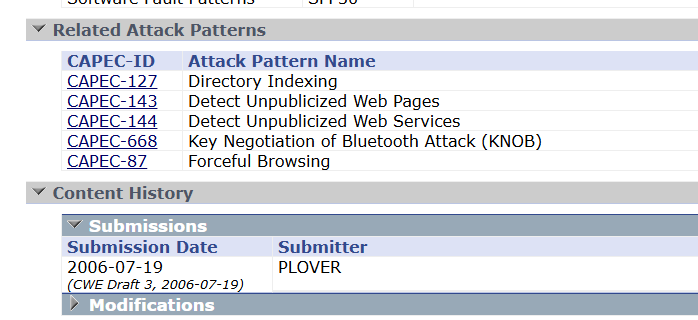

#### [Más información sobre CWE-425](https://cwe.mitre.org/data/definitions/425.html)

---

## Información sobre Patrones de Ataque (CAPEC)

La vulnerabilidad **CVE-2024-0204** puede ser explotada mediante el patrón de ataque **CAPEC-127: Directory Indexing**.

### **CAPEC-127: Directory Indexing**
El patrón de ataque PAEC-127 se refiere a la exposición del listado de directorios (también conocida como **"Directory Listing" o "Forced Browsing"**). Ocurre cuando un sistema permite a un atacante ver el contenido de un directorio sin restricciones, lo que puede revelar información sensible, como archivos de configuración, copias de seguridad, scripts o nombres de usuario.

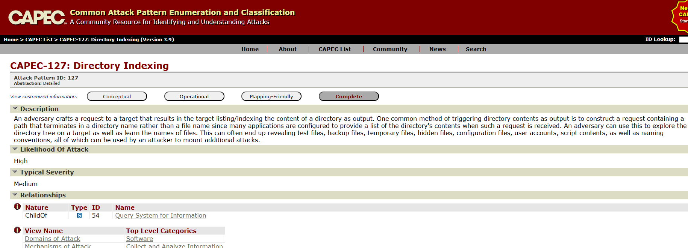

#### [Más información sobre CAPEC-127](https://capec.mitre.org/data/definitions/127.html)

### **CAPEC-143: Detect Unpublicized Web Pages**
Un adversario busca en un sitio web de destino páginas web que no se han publicado. Al hacerlo, el adversario puede obtener acceso a información que el sitio de destino no tenía intención de hacer pública.

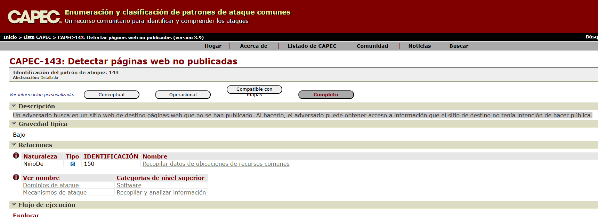

#### [Más información sobre CAPEC-143](https://capec.mitre.org/data/definitions/143.html)

---

## Descarga del Registro CVE de la vulnerabilidad

El registro de CVE contiene información estandarizada sobre esta vulnerabilidad. Esta información puede ser utilizada por herramientas de seguridad para análisis automatizado de la información.
Podemos descargarla o acceder a su información, desde la página de cve.org dándole al enlace View JSON

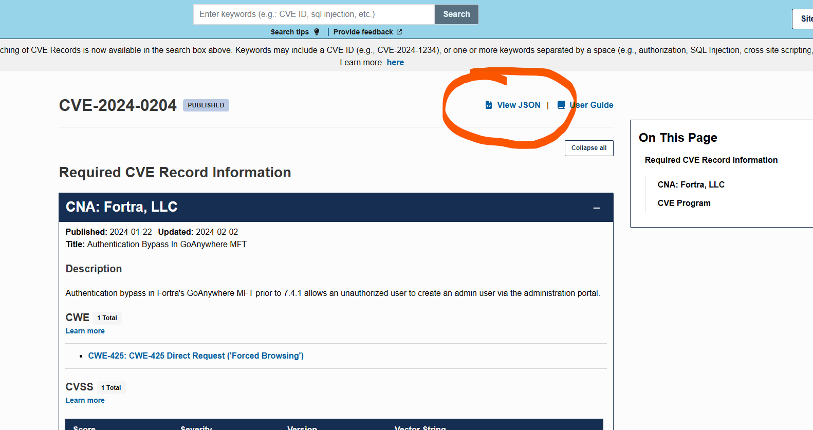

Podemos ver más información en el **JSON**

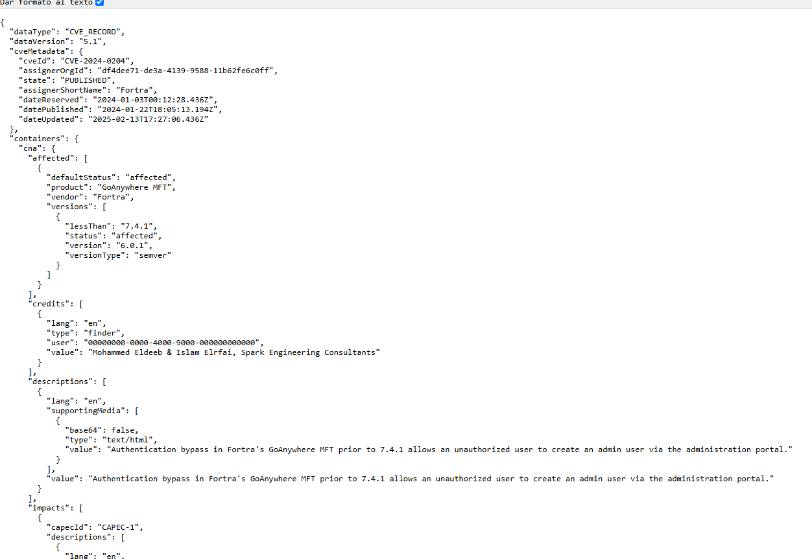

- **Acceso a la información**: [CVE Record - CVE-2024-0204 en cve.org](https://cveawg.mitre.org/api/cve/CVE-2024-0204)

---

## Referencias

- **Autenticación de Fortra en GoAnywhere MFT**:  
   [Enlace a la página de Fortra con más detalles](https://www.fortra.com/security)

- **NIST (National Institute of Standards and Technology)**:  
   [NVD - CVE-2024-0204 en NIST](https://nvd.nist.gov/vuln/detail/CVE-2024-0204)

---
